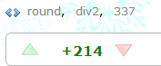

<section>
#Codeforces Round #337 (Div. 2)
- [contest link](http://codeforces.com/contest/610)  
  

　　CF#337，难度一般，质量颇低，堪称无聊。我也是没有见过评分这么低的比赛了。  
　　  
　　小号([zhy](http://codeforces.com/profile/zhy))刷分，结果坑在D题上，rank 102，rating+70，还是没能追上大号([Des_Payfor](http://codeforces.com/profile/Des_Payfor))，但是Good Bye 2015还是决定用大号做了。    

- ##[610A-Pasha and Stick](http://codeforces.com/contest/610/problem/A)  
题意：  
　　一根长度为n的棍子，分成四段，要组成一个长方形，但非正方形，问有多少种组合。 　　  
解法：  
　　首先，n为奇数，答案是0；n为偶数需要考虑n/2，也就是`长+宽`是奇数还是偶数，如果是偶数那就要排除`(n/4,n/4,n/4,n/4)`的情况。所以如果n/2是奇数，`ans = n/2/2`，否则`ans = (n/2-1)/2`，然后汇总一下就是`ans = (n/2-1)/2`了。    
  [code](https://github.com/zhyack/Codeforces/blob/master/610_Round%20%23337(Div.%202)/610A.cpp)  

- ##[610B-Vika and Squares](http://codeforces.com/contest/610/problem/B)  
题意：  
　　一个序列，从某个地方开始，依次循环向右走，走过的地方值都-1，遇到值为0的就停止，问最多能走多少步。 　　  
解法：  
　　其实就是求循环序列中值都大于最小值的最长子串的长度l。比如`2,4,2,3,3`就是`3,3`最长，l = 2;`10,10,10,1,10,10`就是`10,10,10,10,10`最长，l = 5。然后`ans = minval*n+l`。需要注意的是long long。　　
  　　
  　　
  　　  
  [code](https://github.com/zhyack/Codeforces/blob/master/610_Round%20%23337(Div.%202)/610B.cpp)  

- ##[610C-Harmony Analysis](http://codeforces.com/contest/610/problem/C)  
题意：  
　　构造出一种2^k个长为2^k的01串，要求它们两两之间按位异或的0和1个数一样（也就是相同的位和不同的位个数一样）。 　　  
解法：  
　　个人以为这种题是最不应该出现在比赛中的题了，真的是做出来都没有丝毫成就感。非要说思路，只能说`2^k * 2^k`的矩阵可以拆成`2^(k-1) * 2^(k-1) *4`。所以——呵呵，看看样例就能发现规律了。　  
  [code](https://github.com/zhyack/Codeforces/blob/master/610_Round%20%23337(Div.%202)/610C.cpp)  

- ##[610D-Vika and Segments](http://codeforces.com/contest/610/problem/D)  
题意：  
　　求n个矩形在坐标系中覆盖的面积。 　　  
解法：  
　　这种题是另一种不应该出现在比赛中的题——多少年前的模板题了...线段树+离散化+扫描线——博主懒癌又犯了，跪舔两年前的烂代码去了，结果Re到死。看来年轻时写的代码还是不靠谱呀...  
　　不知道这个经典模板题的同学们可以参考[POJ1389](http://poj.org/problem?id=1389)。　　  
  code  
