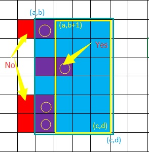

<section>
#Codeforces Good Bye **2015**
- [contest link](http://codeforces.com/contest/611)  
  

　　2015最后一场CF，Div.1，Div.2混战，题目个人感觉不太对胃口，偏难了吧。　　
　　拿大号([Des_Payfor](http://codeforces.com/profile/Des_Payfor))怒跪一场，不过还好不太遗憾，D题虽然没交上，但最终还是TLE的，是在下输了...  
　　根据这两年参加年终大战的经验→_→混战容易涨分...
　　  

- ##[611A-New Year and Days](http://codeforces.com/contest/611/problem/A)  
题意：  
　　翻阅日历，求2016年周X有几个，或求X号有几个。　  
解法：  
　　本应该是个很简单的题，可能参赛的压力都比较大，博主7分钟交了3次才过pretests，而这个时候竟然才只有一小部分人过了pretests，汗(-__-)||。  
　　需要注意的是——2016是**闰年**，所以2月29天，一年366天。`366%7=2`，所以只有周五(`2016.01.01`，和周六`2016.01.02`)比其他周X多一天；X号就可以随便求了，注意`2016.02.29`即可。  
　　抱着试一试赚回脑残罚时的态度看了一遍Room里的情况，竟然收获不小，各种没有注意闰年的或者是注意闰年还打表打错的，甚至还有一个多小时交的还搞不明白输入的...　　
  　　
  　　
  　　  
  [code](https://github.com/zhyack/Codeforces/blob/master/611_Good%20Bye%202015/611A.cpp)  

- ##[611B-New Year and Old Property](http://codeforces.com/contest/611/problem/B)  
题意：  
　　[a,b]范围内二进制表示中只有一个非前导0的数的个数。 　　  
解法：  
　　10^18，稳稳的64位整数以内，也就是说二进制位也就64个，枚举一下符合条件的数——二进制几位，哪一位是0，并检查是不是在[a,b]中即可。　　
  　　
  [code](https://github.com/zhyack/Codeforces/blob/master/611_Good%20Bye%202015/611B.cpp)  

- ##[611C-New Year and Domino](http://codeforces.com/contest/611/problem/C)  
题意：  
　　骨牌的规格是1 * 2或者2 * 1的，q次询问——[(r1i,c1i),(r2i,c2i)]的区块内能放一个骨牌的位置数。 　　  
解法：  
　　二维前缀和的应用。不过由于横竖摆放的性质不同，需要分开处理。  
　　首先，求1 * 2 的骨牌的前缀和矩阵heng[i][j] (1<=i<=h,1<=j<=w)表示[(1,1),(i,j)]这个矩阵内能放的1 * 2的骨牌数量。   
　　要求二维的前缀和，就要先把一维的处理出来，设tmp[i][j] 表示第i行前j个格子，也就是[(i,1),(i,j)]能放下的1 * 2的骨牌数量，这就是普通的前缀和，用以下代码即可轻松求出，非要说是dp我也没什么好争辩的。  

<pre><code>for (int i = 1;i <= N;i++)  
	for (int j = 1;j <= M;j++)  
		if (g[i][j] == '.' && g[i][j-1] == '.') tmp[i][j] = tmp[i][j-1]+1;  
		else tmp[i][j] = tmp[i][j-1];　　
</code></pre>

　　然后有了tmp[i][j]，就可以得到`heng[i][j] = heng[i-1][j]+tmp[i][j]`。  
　　对于2 * 1的骨牌的处理类似，可得到一个shu[i][j]的前缀和矩阵。  
　　此时考虑如果求矩阵[(a,b),(c,d)]内的1 * 2骨牌位置数，要注意矩阵的第一列不在考虑范围内，因为我们之前求出的heng[i][j]其实是说1 * 2的骨牌落脚点在(i,j)，但在[(a,b),(c,d)]内，落脚点不可能是第一列[(a,b),(c,b)]，可参考下图。对于2 * 1的情况的求解，则是不能考虑第一行。  
　　  

　　利用前缀和在O(1)时间内求出对区间[(a,b),(c,d)]的询问，先考虑1 * 2的骨牌，首先`b++`去掉第一列，然后由容斥原理——`ans += heng[c][d]-heng[a-1][d]-heng[c][b-1]+heng[a-1][b-1]`；同理求2 * 1的情况，先`a++`去掉第一行，然后`ans += shu[c][d]-shu[a-1][d]-shu[c][b-1]+shu[a-1][b-1]`，参考下图。  

　　  
　　[code](https://github.com/zhyack/Codeforces/blob/master/611_Good%20Bye%202015/611C.cpp)  

- ##[611D-New Year and Ancient Prophecy](http://codeforces.com/contest/611/problem/D)  
题意：  
　　将一个数字串切成若干段，使之呈一个严格上升的序列。 　　  
解法：  
　　显然dp，方程`dp[i][j] = ∑dp[i][k]，k<j<=i, s[k..j-1] < s[j..i]`，dp[i][j]表示前i个数字以[j..i]为最后一段的情况数。当然，显然如果枚举k的话这个做法是O(N^3)的，必然超时。有若干策略（雾）（利用前缀和）可以将其优化成O(N^2)或者O(NlogN)的（博主下面提供的TLE的代码是O(NlogN)的做法，但是常数可能导致了TLE，仍需优化，仅供参考吧）。  
　　然后还有一个问题，就是比较字符串的时候如果O(N)的比较会使本来O(N^2)的算法还要×这个复杂度，所以就有了做另一个dp的预处理，使比较字符串的工作将为O(1)的操作，详见代码。   
　　详细题解等博主哪天想AC这道题的时候再说吧（懒癌卧床中，勿扰~）。   
  [code](https://github.com/zhyack/Codeforces/blob/master/611_Good%20Bye%202015/611D(TLE).cpp)  

- ##[611E-New Year and Three Musketeers](http://codeforces.com/contest/611/problem/E)  
题意：  待续待续
   　　  
解法：  
  　　
  　　
  　　
  　　  
  code
</section>