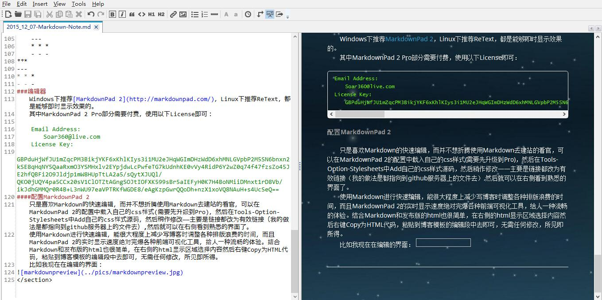

<section>
#Markdown学习笔记
　　HTML是一种发布格式，Markdown是一种书写格式。
###特殊字符
　　`<>&` &rarr; <>&  
　　`&lt;&gt;&amp;` &rarr; &lt;&gt;&amp;  
　　`&amp;lt;` &rarr; &amp;lt;  
　　方便了<,>,&的输入，空格还是要&amp;nbsp;来输入。
###换行和缩进
　　换行时输入两个连续空格和一个换行，Markdown将自动将其转为&lt;/br>  
　　缩进不能使用空格或制表符缩进，可以使用两个中文全角的空格来对齐，不过切换起来还是比较麻烦。
###标题
---
	#HeadTest
	##HeadTest
	###HeadTest
	####HeadTest
	#####HeadTest
	######HeadTest
#HeadTest
##HeadTest
###HeadTest
####HeadTest
#####HeadTest
######HeadTest
	HeadTest
	=
	HeadTest
	-
	HeadTest
HeadTest
=
HeadTest
-
HeadTest  

---
###引用
	> here quote from link1
	> > link1 quote from link2
	> ####markdown head
> here quote from link1
> > link1 quote from link2
> ####markdown head  
###列表
	* l1
	* l2
	+ l3
	- l4
	3. ol1	
	7. ol2
	1. ol3
	
	***
	3. ol1
	7. ol2
	1. ol3
	
			codehere
	12. 34*1 = 12.34
	
	12\. 34*1 = 12.34
* l1
* l2
+ l3
- l4  
3. ol1
7. ol2
1. ol3

***
3. ol1
7. ol2
1. ol3 

		codehere

12. 34*1 = 12.34  

12\. 34*1 = 12.34
###Code
	`codelines`

	(TAB)codeblocks
`codelines`  

	codeblocks
###粗体、斜体
	*italic*
	**strong**
	_italic_
	__strong__
*italic*  
**strong**  
_italic_  
__strong__  
###链接、图片
	[zhy's blog](https://zhyack.github.io/)  
	
[zhy's blog](https://zhyack.github.io/)  
  
仅提供简单的链接和图片功能，其他属性的设置仍需&lt;a>、&lt;img>等标签
###分割线
	***
	---
	* * *
	- - -
***
---
* * *
- - -
###编辑器
　　Windows下推荐[MarkdownPad 2](http://markdownpad.com/)，Linux下推荐ReText，都是能够即时显示效果的。  
　　其中MarkdownPad 2 Pro部分需要付费，使用以下License即可：

    Email Address:
	　　Soar360@live.com 
	License Key:
	　　GBPduHjWfJU1mZqcPM3BikjYKF6xKhlKIys3i1MU2eJHqWGImDHzWdD6xhMNLGVpbP2M5SN6bnxn2kSE8qHqNY5QaaRxmO3YSMHxlv2EYpjdwLcPwfeTG7kUdnhKE0vVy4RidP6Y2wZ0q74f47fzsZo45JE2hfQBFi2O9Jldjp1mW8HUpTtLA2a5/sQytXJUQl/QKO0jUQY4pa5CCx20sV1ClOTZtAGngSOJtIOFXK599sBr5aIEFyH0K7H4BoNMiiDMnxt1rD8Vb/ikJdhGMMQr0R4B+L3nWU97eaVPTRKfWGDE8/eAgKzpGwrQQoDh+nzX1xoVQ8NAuH+s4UcSeQ==
####配置MarkdownPad 2
　　只是喜欢Markdown的快速编辑，而并不想折腾使用Markdown去建站的看官，可以在MarkdownPad 2的配置中载入自己的css样式(需要先升级到Pro)，然后在Tools-Option-Stylesheets中Add自己的css样式源码，然后稍作修改——主要是链接都改为有效链接（我的做法是都指向到github服务器上的文件去）,然后就可以在右侧看到熟悉的界面了。  
　　使用Markdown进行快速编辑，能很大程度上减少写博客时调整各种排版浪费的时间，而且MarkdownPad 2的实时显示速度绝对完爆各种前端可视化工具，给人一种流畅的体验。结合Markdown和发布版的html也很简单，在右侧的html显示区域选择内容然后右键Copy为HTML代码，粘贴到博客模板的编辑段中去即可，无需任何修改，所见即所得。  
　　比如我现在在编辑的界面：

</section>