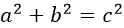

#MathJax 公式编辑学习笔记
为什么用MathJax，我只放一张图：  
  
使用MathJax，公式就可以在页面中这样显示：  
\\(a^2 + b^2 = c^2\\)  
公式显示风格完全是可以订制的。具体安装配置见文末。

##基本用法
* 独占一行，居中显示的公式——`\[YOURFORMULA\]`或`$$YOURFORMULA$$`。如：
\\[MYFORMULA+-*/\\]
* 嵌入式的公式——`\(YOURFORMULA\)`。如 \\(MYFORMULA+-*/\\)

##符号
* 可直接使用的符号： `\\(+\quad -\quad =\quad !\quad /\quad (\quad )\quad [\quad ]\quad <\quad >\quad |\quad '\quad :\quad [a..z]\quad [A..Z]\quad [0..9]\quad ,\quad .\\) `\\(+\quad -\quad =\quad !\quad /\quad (\quad )\quad [\quad ]\quad <\quad >\quad |\quad '\quad :\quad [a..z]\quad [A..Z]\quad [0..9]\quad ,\quad .\\)
* 其他常用符号：
	* 希腊字母：  `\\(\alpha\quad\beta\quad\gamma\quad\pi\quad\phi\quad\varphi\quad\theta\\)`\\(\alpha\quad\beta\quad\gamma\quad\pi\quad\phi\quad\varphi\quad\theta\\)  `\\(\Gamma\quad\Pi\quad\Phi\quad\Theta\\)`\\(\Gamma\quad\Pi\quad\Phi\quad\Theta\\)
	* 函数符号：`\\(\cos\quad\sin\quad\tan\quad\exp\quad\\)`  \\(\cos\quad\sin\quad\tan\quad\exp\quad\\)
	* 运算符号：`\\(\lim\quad\bmod\quad\pmod x\quad\equiv\quad \times \quad  \sqrt \quad  \sum\_{i=1}^{10} xi \quad \displaystyle\sum\_{i=1}^{10} xi \quad \int\_0^\infty \quad  \\)` \\(\lim\quad\bmod\quad\pmod x\quad\equiv\quad \times \quad  \sqrt \quad  \sum\_{i=1}^{10} xi \quad \displaystyle\sum\_{i=1}^{10} xi \quad \int\_0^\infty \quad  \\)   
	`\\(\oplus\quad  \odot\quad  \cup\\quad  \cap\quad  \vee\quad  \wedge\quad  \iiint\quad  \oint\quad  \prod\quad  \int\limits\_a^b\quad \sum\_{\substack{0<i<m \\\\ 0<j<n}<!---->}P(i,j)\\)`  \\(\oplus\quad  \odot\quad  \cup\\quad  \cap\quad  \vee\quad  \wedge\quad  \iiint\quad  \oint\quad  \prod\quad  \int\limits\_a^b\quad \sum\_{\substack{0<i<m \\\\ 0<j<n}<!---->}P(i,j)\\)
	* 集合符号：`\\(\in\quad \notin \quad \\)`\\(\in\quad \notin \quad \\)  
	* 上标下标：`\\(x\_i\quad x\_{i+1}\quad x^2\quad x^{i+1}\quad x\_{i+1}^{j*2}\quad x| \_{x=2}\\)`  \\(x\_i\quad x\_{i+1}\quad x^2\quad x^{i+1}\quad x\_{i+1}^{j*2}\quad x| \_{x=2}\\)  
	* 括号： `\\((a)\quad [b]\quad \{c\}\quad \langle d \rangle \quad  \lfloor e \rfloor \quad  \lceil f \rceil \quad \left(\frac{a \over b}{c+d}  \right) \quad (\big)\Big(\bigg)\Bigg()\quad   \begin{cases}1\\\\2\\\\3\\\\ \end{cases} \\)  `  \\((a)\quad [b]\quad \{c\}\quad \langle d \rangle \quad  \lfloor e \rfloor \quad  \lceil f \rceil \quad \left(\frac{a \over b}{c+d}  \right) \quad (\big)\Big(\bigg)\Bigg()\quad   \begin{cases}1\\\\2\\\\3\\\\ \end{cases} \\)  
	* 分数： `\\(\frac{\frac{2a}{b^2}}{c+d}\quad {a \over b+c} \quad ^4/\_5 \quad \\)`  \\(\frac{\frac{2a}{b^2}}{c+d}\quad {a \over b+c} \quad ^4/\_5 \quad \\)  
	* 组合数： `\\({n \choose k}\quad \binom{n}{k}\\)`  \\({n \choose k}\quad \binom{n}{k}\\)   
	* 矩阵： `\\[\begin{matrix}1 & 2 \\\\ 3 & 4 \end{matrix} \times \begin{matrix}1 & 2 \\\\ 3 & 4 \end{matrix} = \begin{matrix}? & ? \\\\ ? & ? \end{matrix}\\]`  \\[\begin{matrix}1 & 2 \\\\ 3 & 4 \end{matrix} \times \begin{matrix}1 & 2 \\\\ 3 & 4 \end{matrix} = \begin{matrix}? & ? \\\\ ? & ? \end{matrix}\\]  `\\(\begin{smallmatrix}1 & 2 \\\\ 3 & 4 \end{smallmatrix} \times \begin{smallmatrix}1 & 2 \\\\ 3 & 4 \end{smallmatrix} = \begin{smallmatrix}? & ? \\\\ ? & ? \end{smallmatrix}\\) `\\(\begin{smallmatrix}1 & 2 \\\\ 3 & 4 \end{smallmatrix} \times \begin{smallmatrix}1 & 2 \\\\ 3 & 4 \end{smallmatrix} = \begin{smallmatrix}? & ? \\\\ ? & ? \end{smallmatrix}\\)  
	* 其他：`\\(\pm\quad \mp\quad \dots \quad \infty \quad \boldsymbol{\alpha} \quad vs \quad \alpha \quad \color{red}{i'm\quad red}\\)`  \\(\pm\quad \mp\quad \dots \quad \infty \quad \boldsymbol{\alpha} \quad vs \quad \alpha \quad \color{red}{i'm\quad red}\\)   

## 安装与配置  

这里的配置依照的是本博客的搭建需求，原理很简单，自取所需。  

* 最省事的配置方法——把下面的代码放在所需的html的&lt;head&gt;标签中
<pre>
&lt;script src='https://cdn.mathjax.org/mathjax/latest/MathJax.js?config=TeX-AMS-MML_HTMLorMML'&gt;&lt;/script&gt;
</pre>
* 由于cdn速度感人，博主自行从[官方](https://github.com/mathjax/MathJax)clone下来了MathJax包，放在自己的站内，速度就快多了，所以可以这样——把下面的代码放在所需的html的&lt;head&gt;标签中
<pre>
&lt;script src='https://zhyack.github.io/mathjax-local/MathJax.js?config=TeX-AMS-MML_HTMLorMML'&gt;&lt;/script&gt;
</pre>
* 当然订制起来也很简单，比如——我的博客是偏暗色的背景，所以可以通过下面的代码将其公式字体设置为亮色——在mathjax的config文件夹下default.js中修改：
<pre>
	styles: {
			  ".MathJax .merror": {
			    color:   "#FFFFFF",
			    "font-style": "normal",
			    "font-size":  "100%"
			  }
	}
</pre>
* 每个页面上加段脚本代码也是可以临时设置的——把下面的代码放在所需的html的&lt;head&gt;标签中
<pre>
&lt;script type="text/x-mathjax-config">
  MathJax.Hub.Config({
    styles: {
		  ".MathJax .merror": {
		    color:   "#FFFFFF",
		    "font-style": "normal",
		    "font-size":  "100%"
		  }
		
		}
  });
&lt;/script&gt;
</pre>
* 最后提一下——MarkdownPad2中也可以相应的配置——Tools-Options-Advanced-HTML Head Editor中添加&lt;head&gt;标签，然后预览为html时可以达到同样的效果。从某种意义上来说，确实可以部分取代LaTex了，然而Markdown的**\\  \_  \***这几个符号的输入很不友好，给写公式带了一定的影响。
