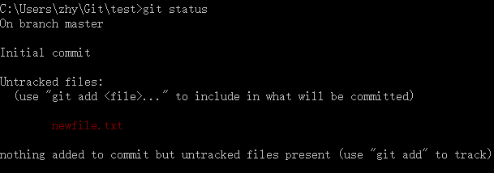
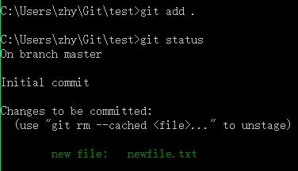
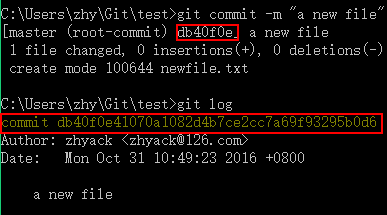
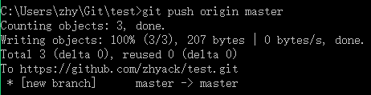
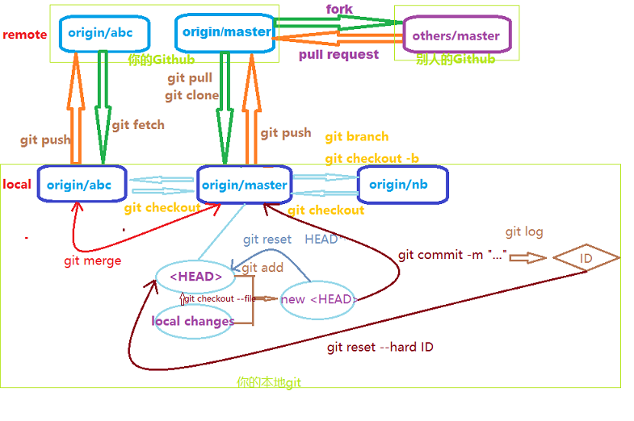

# 简单的Git起步指南
* ##何为Git？
[Git](https://git-scm.com/)是一种一般用于管理代码的版本控制系统，与之处于同一level上的还有svn，cvs等。它既可以在本地使用，又可以通过网络服务器进行远程管理，常见的远程服务供应商有github和bitbucket等。  
当然对于刚起步者来说，也可以简单地将git看作这么一个东西：  
  
这个隐藏文件夹一般都会是你整个repo（仓库——表示一整个项目，本地会存储在对应项目名的文件夹下）中最占空间的，但要知道它包含着你以往所有commit过的版本信息，只要这个文件夹完整，你的历史commit过的各个版本永远都不会丢。

* ##为什么使用Github？
原因很简单——永远不要把鸡蛋放在一个篮子里。放在本地的git仓库随时都面临着各种可能导致数据丢失的危险，一旦关键的`.git`数据丢失，以往的版本都将一去不复返，更何况一般丢数据都是整个项目一起挂掉的。  
	* 如果使用U盘/硬盘/云盘进行数据备份，那会面临着备份繁琐，容易忘记备份时间、版本，以及系统提示你对于同名文件是替换还是跳过的窘境，当然还有一种更囧的场景——你将文件A改名为文件B，备份时系统也没提示你是否替换或跳过，结果你的备份里就莫名多了一个垃圾文件... 使用git可以很大程度上解决以上问题。git会根据你当前的版本信息`<HEAD>`，以及你当前本地文件信息，判断出你到底做出了哪些改动；通过将改动`add`到`<HEAD>`中，就会更新到你的新版本信息中，然后通过`commit`即可生成新的版本，这整个过程是增量式的，不会说改动后还存在任何垃圾，而且所有的改动只需正常在本地添加、删除、修改文件即可。当然，git也并不是万能的，在`merge`两个版本时它也会面临着不可能完美解决的问题——两个版本的文件保留哪个？但git会产生`diff`信息，以便于手工选择保留的部分。
	* 作为git的网络服务供应商，[github](https://github.com)可谓是最大的开源代码共享平台，其开源项目之多，以及完美的`fork`机制，漂亮实用的界面，还有`gist`等功能，无疑是开源项目搭载平台的首选。但其免费功能中不包括私有仓库，也就是说你的所有代码都是公开的。如果有私有仓库的需求，推荐[bitbucket](https://bitbucket.org)，对于个人或者小团体的私有项目可以充分满足需求，而且有国内的cdn，访问速度比github快。当然，两个网站都支持搭建个人主页，可参见[我的博客](https://zhyack.github.io/posts/2015_11_23_How-To-Build-Your-Blog-On-Github-Pages.html)搭建笔记。  


> 以下部分都以github平台为例。

* ##git安装&配置
[git下载](https://git-scm.com/downloads)  
国内下载可能会慢的出奇，迅雷也许可以快点...
	* 下载完成后无脑安装，配置都默认就可以，提示安装git-bash时推荐安装。
	* 安装完成后打开git-bash即可使用git的各种命令了。
	* 为了在Windows的cmd和powershell方便地用git命令，将git路径`C:\Program Files\Git\cmd`添加到环境变量中去。
	* 首次使用git时可能会提示输入用户名和邮箱，好好填写（认真脸.jpg）：
```
git config --global user.name "username"
git config --global user.email "email"
```
* ##新建仓库
github右上角


然后导入到本地即可编辑

* ##导入仓库
github和bitbucket的仓库中都会提供https链接和ssh链接以供导入


区别在于https无须任何设置，但任何远程操作需要提供账号密码作为凭据； ssh需要在本地生产ssh-key，这样你的机器拥有唯一的key可以免账号密码验证直接与远程交互。入门推荐https。
本地git-bash或cmd中在合适位置使用类似**git clone** `https://github.com/zhyack/test.git`的命令从github上获取仓库内容，链接换成自己的。


这样远程的仓库就拿到本地了。

* ##当前版本信息
使用**git status**查看当前处于哪个分支，以及本地文件改动情况。


* ##添加/回撤本地改动
	* 使用**git add**将本地改动添加到`<HEAD>`中，添加个别文件用`git add <file path>`，但一般都是添加所有改动`git add .`    
	
	* 如果还未使用`git add`添加改动，但又后悔对某个文件的改动，可以使用`git checkout <file path>`对文件进行回撤
	* 如果已经使用了`git add`，但又后悔所做的改动，可以使用`git reset HEAD`使`<HEAD>`回滚到原来的状态，但文件内容是没有发生改变的。
* ##提交/回撤本地改动
	* 在`git add`之后如果确定要提交/保存这次改动就使用**git commit**进行提交，一般命令形式为`git commit -m "..."`，其中最后的字串为附加信息，随意填写。
	* 在使用`git commit`之后会产生一个版本号`commit_id`，历史的版本号可以使用`git log`查看到，如果后悔了最近的某一次/几次提交，可以使用`git reset --hard commit_id`来进行回撤，但注意**--hard 回撤会删除对应commit的所有改动，无法找回**；如果只是想将版本号前移而不希望本地文件有任何改动，可以不加`--hard`，也就是`git reset commit_id`，但回撤掉的`commits`还是无法找回的。  
	
* ##提交/同步到Github
	* 使用**git push**命令对本地的commit向远程服务器进行提交，一般来说默认的分支是`origin/master`，所以提交的命令为`git push origin master`
	
	* 如果你有两台机器维护一个仓库，那么就会有这样一个问题——一台机器改动之后，另一台机器上的文件是不会跟着改动的，导致两个本地之间，本地和远程之间的不同步。如果是这种情况，在其中一台本地机器上进行`git push`之后，要记得在另外一台机器做出本地改动之前进行**git pull**来同步远程，一般命令为`git pull origin master`，否则你可能会面临着要手动`merge`的窘境。

> 以上内容可以满足基本需求，体验git的更多便利可以继续往下看...

* ##多分支
	* 使用**git branch $branch_name**来创建新的分支
	* 使用**git checkout $branch_name**来切换分支，但切换之前必须将当前分支的改动commit掉
	* 多分支的作用——临时改动（测试），多版本分工，保留历史版本等等
	* 具体可根据[官方教程](https://git-scm.com/book/zh/v1/Git-%E5%88%86%E6%94%AF-%E5%88%86%E6%94%AF%E7%9A%84%E6%96%B0%E5%BB%BA%E4%B8%8E%E5%90%88%E5%B9%B6)做一遍，就可以简单应用了。
* ##.gitignore
	* 本地的代码运行时可能产生一些工程文件、编译文件、可执行程序等，这是我们不希望保存和上传的，可以借助**.gitignore**来实现对`git add`的控制，具体参见[博文](https://zhyack.github.io/posts/2016_06_14-Gitignore.html)
* ##fork & pull request
	* fork会保留原作者信息，在fork后的仓库中有指向原仓库的链接
	* fork后的仓库归自己所有，在本地显示的branch是`origin/master`，不会影响原仓库；但如果你认为你的改动有助于原项目的改善，可以向原项目发送`pull request`，原仓库的持有者会受到消息并判断是否要将你的改动并入原仓库。
	* 其实也可以看作是`fork`原分支是在你的账户下的一个远程分支，原仓库的持有者可以选择是否`merge`。
* ##概览
  