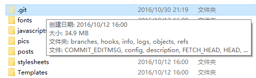
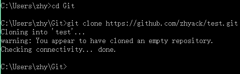

# 简单的Git起步指南
* ##何为Git？
[Git](https://git-scm.com/)是一种一般用于管理代码的版本控制系统，与之处于同一level上的还有svn，cvs等。它既可以在本地使用，又可以通过网络服务器进行远程管理，常见的远程服务供应商有github和bitbucket等。  
当然对于刚起步者来说，也可以简单地将git看作这么一个东西：  
  
这个隐藏文件夹一般都会是你整个repo（仓库——表示一整个项目，本地会存储在对应项目名的文件夹下）中最占空间的，但要知道它包含着你以往所有commit过的版本信息，只要这个文件夹完整，你的历史commit过的各个版本永远都不会丢。

* ##为什么使用Github？
原因很简单——永远不要把鸡蛋放在一个篮子里。放在本地的git仓库随时都面临着各种可能导致数据丢失的危险，一旦关键的`.git`数据丢失，以往的版本都将一去不复返，更何况一般丢数据都是整个项目一起挂掉的。  
	* 如果使用U盘/硬盘/云盘进行数据备份，那会面临着备份繁琐，容易忘记备份时间、版本，以及系统提示你对于同名文件是替换还是跳过的窘境，当然还有一种更囧的场景——你将文件A改名为文件B，备份时系统也没提示你是否替换或跳过，结果你的备份里就莫名多了一个垃圾文件... 使用git可以很大程度上解决以上问题。git会根据你当前的版本信息`<HEAD>`，以及你当前本地文件信息，判断出你到底做出了哪些改动；通过将改动`add`到`<HEAD>`中，就会更新到你的新版本信息中，然后通过`commit`即可生成新的版本，这整个过程是增量式的，不会说改动后还存在任何垃圾，而且所有的改动只需正常在本地添加、删除、修改文件即可。当然，git也并不是万能的，在`merge`两个版本时它也会面临着不可能完美解决的问题——两个版本的文件保留哪个？但git会产生`diff`信息，以便于手工选择保留的部分。
	* 作为git的网络服务供应商，[github](https://github.com)可谓是最大的开源代码共享平台，其开源项目之多，以及完美的`fork`机制，漂亮实用的界面，还有`gist`等功能，无疑是开源项目搭载平台的首选。但其免费功能中不包括私有仓库，也就是说你的所有代码都是公开的。如果有私有仓库的需求，推荐[bitbucket](https://bitbucket.org)，对于个人或者小团体的私有项目可以充分满足需求，而且有国内的cdn，访问速度比github快。当然，两个网站都支持搭建个人主页，可参见[我的博客](https://zhyack.github.io/posts/2015_11_23_How-To-Build-Your-Blog-On-Github-Pages.html)搭建笔记。  


> 以下部分都以github平台为例。

* ##git安装&配置
[git下载](https://git-scm.com/downloads)  
国内下载可能会慢的出奇，迅雷也许可以快点...
	* 下载完成后无脑安装，配置都默认就可以，提示安装git-bash时推荐安装。
	* 安装完成后打开git-bash即可使用git的各种命令了。
	* 为了在Windows的cmd和powershell方便地用git命令，将git路径`C:\Program Files\Git\cmd`添加到环境变量中去。
	* 首次使用git时可能会提示输入用户名和邮箱，好好填写（认真脸.jpg）：
```
git config --global user.name "username"
git config --global user.email "email"
```
* ##新建仓库
github右上角


然后导入到本地即可编辑

* ##导入仓库
github和bitbucket的仓库中都会提供https链接和ssh链接以供导入


区别在于https无须任何设置，但任何远程操作需要提供账号密码作为凭据； ssh需要在本地生产ssh-key，这样你的机器拥有唯一的key可以免账号密码验证直接与远程交互。入门推荐https。
本地git-bash或cmd中在合适位置使用类似**git clone** `https://github.com/zhyack/test.git`的命令从github上获取仓库内容，链接换成自己的。


这样远程的仓库就拿到本地了。

* ##当前版本信息
